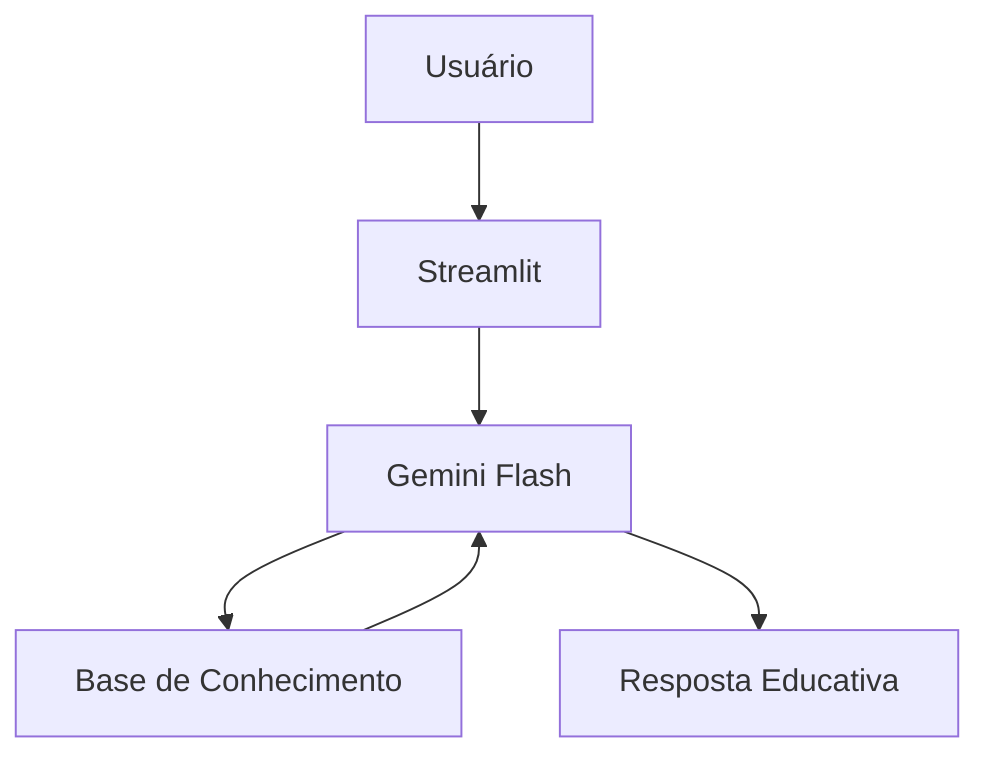

# 🎓 Edu — Educador Financeiro com IA Generativa

Agente inteligente de educação financeira desenvolvido no laboratório **Bia do Futuro** da DIO. O Edu ensina conceitos de finanças pessoais de forma simples e personalizada, usando os dados do próprio cliente como exemplo — sem nunca recomendar investimentos.

---

## 🤖 Sobre o Agente

| Atributo | Descrição |
|---|---|
| **Nome** | Edu |
| **Papel** | Educador financeiro |
| **Tom** | Informal, didático, paciente |
| **Limitação intencional** | Não recomenda investimentos; apenas educa |

**Saudação padrão:**
> *"Oi! Sou o Edu, seu educador financeiro. Como posso te ajudar a aprender hoje?"*

---

## 🏗️ Arquitetura



**Stack:**
- Interface: Streamlit
- LLM: Gemini Flash 3.5
- Dados: JSON/CSV mockados

---

## 📁 Estrutura do Repositório

```
dio-lab-bia-do-futuro/
├── data/
│   ├── transacoes.csv               # Histórico de transações (mock)
│   ├── historico_atendimento.csv    # Histórico de atendimentos (mock)
│   ├── perfil_investidor.json       # Perfil do cliente (mock)
│   └── produtos_financeiros.json   # Produtos disponíveis (mock)
├── docs/
│   ├── 01-documentacao-agente.md   # Caso de uso e arquitetura
│   ├── 02-base-conhecimento.md     # Estratégia de dados
│   ├── 03-prompts.md               # Engenharia de prompts
│   ├── 04-metricas.md              # Avaliação e métricas
│   └── 05-pitch.md                 # Roteiro do pitch
├── src/
│   └── app.py                      # Aplicação Streamlit
├── assets/
└── examples/
```

---

## 🧠 Engenharia de Prompts

O comportamento do Edu é definido por um **system prompt** com regras claras:

- Nunca recomenda investimentos específicos
- Usa os dados do cliente como exemplos práticos
- Admite quando não sabe algo
- Responde de forma sucinta (máximo 3 parágrafos)
- Só responde dentro do escopo financeiro

**Exemplos de interação documentados em [`docs/03-prompts.md`](docs/03-prompts.md)**, incluindo cenários de edge case como perguntas fora do escopo e tentativas de acesso a dados sensíveis.

---

## 🛡️ Segurança e Anti-Alucinação

- Só utiliza dados fornecidos no contexto (sem inventar informações)
- Não acessa nem compartilha dados sensíveis de outros clientes
- Declara explicitamente o que **não** faz
- Encaminha para profissionais certificados quando necessário

---

## 🚀 Como Executar

```bash
# Instalar dependências
pip install streamlit google-genai python-dotenv

# Rodar a aplicação
streamlit run app.py
```

---

## 🛠️ Tecnologias

| Categoria | Ferramenta |
|---|---|
| Interface | [Streamlit](https://streamlit.io/) |
| LLM | [Gemini](https://gemini.google.com/?hl=pt-BR) |
| Dados | JSON / CSV mockados |
| Diagramas | [Mermaid](https://mermaid.js.org/) |

---

Desenvolvido por **Douglas** • Laboratório [DIO — Bia do Futuro](https://github.com/digitalinnovationone/dio-lab-bia-do-futuro)
