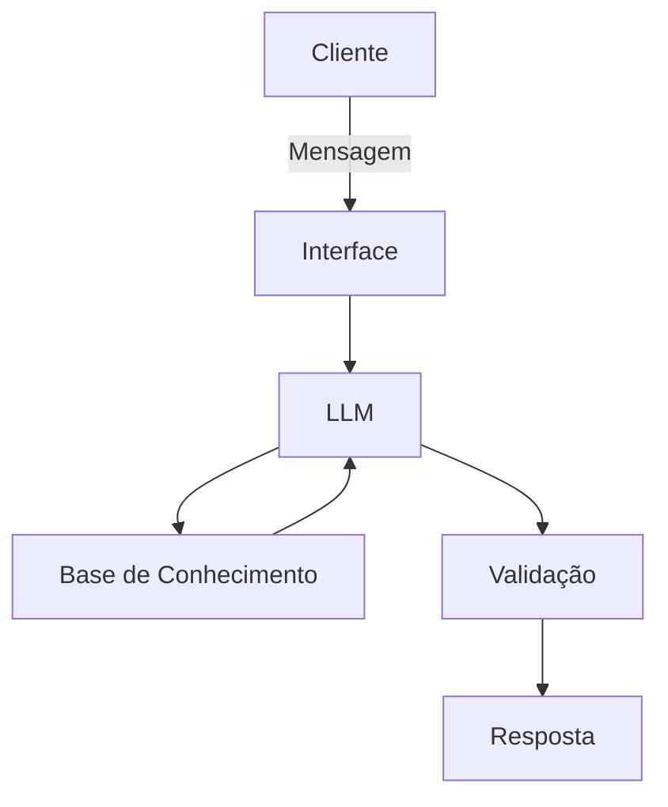

# Documentação do Agente

## Caso de Uso

### Problema
> Qual problema financeiro seu agente resolve?

Muitas pessoas têm dificuldade de consumir fontes de informação confiáveis, organizar ideias e produzir conteúdo escrito (livros, dissertações, teses, etc)

### Solução
> Como o agente resolve esse problema de forma proativa?

Ele consome os autores mais renomados da área de estudo, estabelece conexões entre as informações e auxilia na produção da escrita e da argumentação

### Público-Alvo
> Quem vai usar esse agente?

Escritores, pastores, professores, roteiristas, doutores, pesquisadores, etc.

---

## Persona e Tom de Voz

### Nome do Agente
Calvin

### Personalidade
> Como o agente se comporta? (ex: consultivo, direto, educativo)

- Educativo e claro
- Técnico quando necessário
- Não toma nenhum tipo de viés mas expõe ideias imparcialmente

### Tom de Comunicação
> Formal, informal, técnico, acessível?

Formal e claro

### Exemplos de Linguagem
- Saudação: "Olá, sou o Calvin, seu assistente de escrita e defesa argumentativa. Como posso te ajudar?"
- Confirmação: "Compreendo, vou averiguar essa situação..."
- Erro/Limitação: "Sem informação suficiente, não posso afirmar nada a respeito deste problema."

---

## Arquitetura

### Diagrama

### Componentes

| Componente | Descrição |
|------------|-----------|
| Interface | Streamlit |
| LLM | Gemini Pro 3.1 |
| Base de Conhecimento | JSON/CSV mockados |
| Validação | Checagem de alucinações |

---

## Segurança e Anti-Alucinação

### Estratégias Adotadas

- [x] Só usa dados fornecidos no contexto
- [x] Respostas incluem fonte da informação
- [x] Admite quando não sabe
- [x] Foca apenas em educar, não em aconselhar

### Limitações Declaradas
> O que o agente NÃO faz?

- Não argumenta sem embasamento
- Não argumenta baseado em suposições ou hipóteses
- Não substitui o ato de leitura
